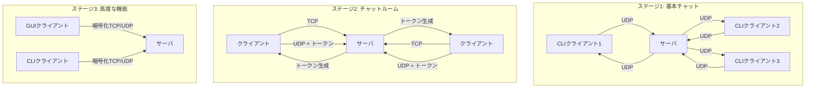

# 設計書

## 概要

オンラインチャットメッセンジャーは、段階的に機能を拡張する3ステージ構成のクライアントサーバアプリケーションです。UDPベースのリアルタイム通信とTCPベースの信頼性の高い制御通信を組み合わせ、スケーラブルで高性能なメッセージングシステムを実現します。

## アーキテクチャ

### 全体アーキテクチャ



### ネットワーク層設計

**二重プロトコル方式:**
- **TCP**: チャットルーム管理（作成、参加、認証）
- **UDP**: リアルタイムメッセージング

**利点:**
- TCPで信頼性が必要な操作を保証
- UDPで低遅延のメッセージング実現
- プロトコル特性を最適活用

## コンポーネントと インターフェース

### サーバコンポーネント

#### 1. UDPメッセージハンドラー
```php
class UDPMessageHandler
{
    public function handleMessage(string $data, string $clientAddr): void;
    public function broadcastMessage(string $message, ?string $excludeAddr = null): void;
    public function parseMessageProtocol(string $data): array; // [username, message]
}
```

#### 2. TCPルーム管理ハンドラー
```php
class TCPRoomHandler
{
    public function handleRoomCreation(string $data, $clientSocket): void;
    public function handleRoomJoin(string $data, $clientSocket): void;
    public function generateClientToken(string $username, string $roomName): string;
    public function validateToken(string $token, string $clientAddr): bool;
}
```

#### 3. クライアント管理システム
```php
class ClientManager
{
    public function addClient(string $addr, string $username, float $lastSeen): void;
    public function removeInactiveClients(float $timeout = 30.0): void;
    public function getActiveClients(): array;
    public function updateLastSeen(string $addr): void;
}
```

#### 4. チャットルーム管理システム
```php
class RoomManager
{
    public function createRoom(string $roomName, string $hostToken, ?string $password = null): bool;
    public function joinRoom(string $roomName, string $clientToken): bool;
    public function getRoomClients(string $roomName): array;
    public function removeRoom(string $roomName): void;
}
```

### クライアントコンポーネント

#### 1. ネットワーククライアント
```php
class NetworkClient
{
    public function connectUdp(string $serverAddr, int $port): void;
    public function connectTcp(string $serverAddr, int $port);
    public function sendUdpMessage(string $message): void;
    public function receiveUdpMessage(): string;
}
```

#### 2. TCRPクライアント
```php
class TCRPClient
{
    public function createRoom(string $roomName, string $username, ?string $password = null): string;
    public function joinRoom(string $roomName, string $username, ?string $password = null): string;
    public function parseTcrpResponse(string $data): array;
}
```

#### 3. CLIインターフェース
```php
class CLIInterface
{
    public function getUsername(): string;
    public function getRoomAction(): string; // "create" or "join"
    public function getRoomName(): string;
    public function displayMessage(string $username, string $message): void;
    public function getUserInput(): string;
}
```

### ステージ3: 高度なコンポーネント

#### 1. 暗号化マネージャー
```php
class EncryptionManager
{
    public function generateKeyPair(): array; // [private_key, public_key]
    public function encryptMessage(string $message, string $publicKey): string;
    public function decryptMessage(string $encryptedData, string $privateKey): string;
    public function exchangePublicKeys($socket): string;
}
```

#### 2. GUIクライアント（Electron.js）
```javascript
class GUIClient {
    connectToServer(serverAddr)
    createRoom(roomName, username, password)
    joinRoom(roomName, username, password)
    sendMessage(message)
    displayMessage(username, message)
    updateUserList(users)
}
```

## データモデル

### メッセージプロトコル（ステージ1）

```
UDP メッセージフォーマット:
[usernamelen: 1byte][username: variable][message: variable]

最大サイズ: 4096 bytes
エンコーディング: UTF-8
```

### TCRPプロトコル（ステージ2）

```
TCRP ヘッダー (32 bytes):
[RoomNameSize: 1byte][Operation: 1byte][State: 1byte][OperationPayloadSize: 29bytes]

TCRP ボディ:
[RoomName: RoomNameSize bytes][OperationPayload: OperationPayloadSize bytes]

操作コード:
- 1: ルーム作成
- 2: ルーム参加

状態コード:
- 0: リクエスト
- 1: 応答
- 2: 完了
```

### UDPチャットルームメッセージ（ステージ2）

```
[RoomNameSize: 1byte][TokenSize: 1byte][RoomName: variable][Token: variable][Message: variable]

最大サイズ: 4096 bytes
```

### データ構造

#### クライアント情報
```php
class ClientInfo
{
    public function __construct(
        public string $address,
        public string $username,
        public float $lastSeen,
        public ?string $token = null,
        public ?string $roomName = null
    ) {}
}
```

#### チャットルーム情報
```php
class ChatRoom
{
    public function __construct(
        public string $name,
        public string $hostToken,
        public ?string $passwordHash = null,
        public array $clients = [],
        public float $createdAt = null
    ) {
        $this->createdAt ??= microtime(true);
    }
}
```

## エラーハンドリング

### ネットワークエラー

1. **接続タイムアウト**
   - クライアント: 再接続試行（最大3回）
   - サーバ: クライアント情報をクリーンアップ

2. **パケット損失（UDP）**
   - ハートビート機能で接続状態監視
   - 非アクティブクライアントの自動削除

3. **TCP接続エラー**
   - 適切なエラーメッセージをクライアントに返送
   - 接続リソースの適切な解放

### プロトコルエラー

1. **不正なメッセージフォーマット**
   - メッセージを無視し、ログに記録
   - クライアントに警告メッセージ送信

2. **認証エラー**
   - 無効なトークンの場合、接続拒否
   - 適切なエラーコードを返送

3. **ルーム管理エラー**
   - 存在しないルームへの参加試行
   - 重複ルーム名の作成試行

### リソース管理エラー

1. **メモリ不足**
   - 古いクライアント情報の定期的なクリーンアップ
   - 最大接続数の制限

2. **ファイルディスクリプタ不足**
   - 接続プールの管理
   - 適切なソケットクローズ

## テスト戦略

### 単体テスト

1. **プロトコル解析テスト**
   - メッセージフォーマットの正確な解析
   - エッジケース（最大サイズ、空メッセージ等）

2. **暗号化テスト**
   - 鍵生成の正確性
   - 暗号化・復号化の整合性

3. **データ構造テスト**
   - クライアント管理機能
   - ルーム管理機能

### 統合テスト

1. **クライアント・サーバ通信テスト**
   - UDP/TCP両プロトコルでの通信
   - 複数クライアント同時接続

2. **チャットルーム機能テスト**
   - ルーム作成・参加フロー
   - トークン認証システム

3. **エラーハンドリングテスト**
   - ネットワーク障害シミュレーション
   - 不正データ送信テスト

### パフォーマンステスト

1. **負荷テスト**
   - 10,000パケット/秒の処理能力
   - 1000同時接続クライアント

2. **ストレステスト**
   - メモリ使用量の監視
   - CPU使用率の測定

3. **レイテンシテスト**
   - メッセージ配信遅延の測定
   - ネットワーク条件による影響評価

### エンドツーエンドテスト

1. **ユーザーシナリオテスト**
   - 基本チャット機能
   - チャットルーム作成・参加
   - GUI操作フロー

2. **セキュリティテスト**
   - 暗号化通信の検証
   - 認証システムの堅牢性

## 実装フェーズ

### フェーズ1: ステージ1実装
- 基本UDPサーバ・クライアント
- メッセージプロトコル
- クライアント管理システム

### フェーズ2: ステージ2実装
- TCPルーム管理システム
- TCRPプロトコル実装
- トークンベース認証

### フェーズ3: ステージ3実装
- 暗号化システム
- GUIクライアント（Electron.js）
- パスワード保護機能

## スケーラビリティ考慮事項

### 水平スケーリング
- ロードバランサーによるトラフィック分散
- 複数サーバインスタンスでの負荷分散
- データベースクラスタリング（将来的な拡張）

### 垂直スケーリング
- マルチプロセス処理（pcntl_fork）
- ReactPHP/Swooleによる非同期I/O
- メモリ効率の最適化

### 分散アーキテクチャ
- マイクロサービス化の検討
- メッセージキューシステムの導入
- 分散キャッシュシステム
